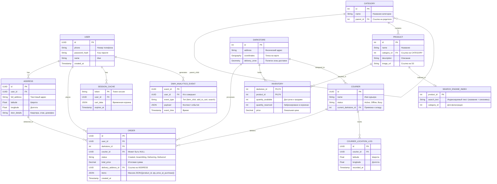
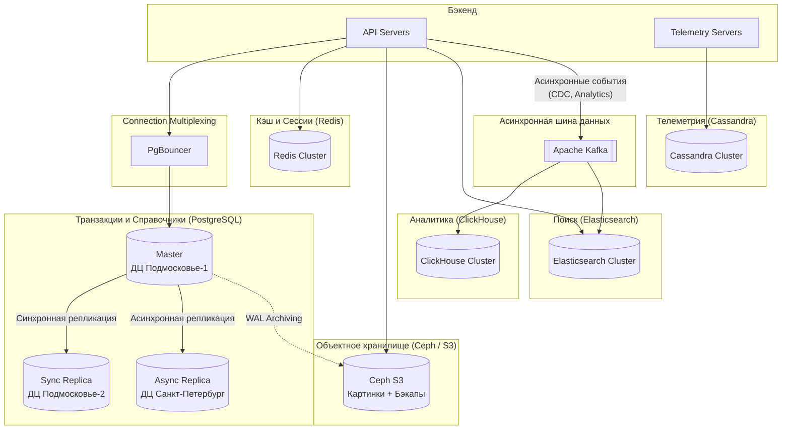

# Яндекс Лавка

## 1. Тема, аудитория, функционал

### 1.1 Тема

Яндекс Лавка - система доставки продуктов питания. Ключевым функционалом сервиса является полный цикл заказа продуктов: от поиска товаров до управления статусами заказа.

### 1.2 Целевая аудитория

- География: 15 крупных городов России [1]
- Количество дарксторов: 663 распределенных точки сборки заказов [4]
- Активность:
  - Среднесуточное количество заказов: 400 тысяч [2]
  - Дневная активная аудитория: ~2 млн пользователей (в среднем 20% посетителей делают заказ)
  - Месячная активная аудитория: ~5 млн пользователей (средняя рыночная частота покупок в сегменте eGrocery — 2.4 заказа на пользователя в месяц)

### 1.3 Ключевой функционал

1.  Определение зоны доставки и даркстора
2.  Просмотр динамического каталога
3.  Поиск по товарам и магазинам
4.  Оформление заказа
5.  Система управления статусами заказа
6.  Назначение курьеров на заказ
7.  Отслеживание курьера на карте в реальном времени

### 1.4 Ключевые продуктовые решения

1.  Курьерское приложение отправляет GPS-координаты каждые 5 секунд
2.  Система производит постоянное отслеживание положения курьеров

## 2. Расчет нагрузки

### 2.1 Расчет среднего пути пользователя

Сценарий «Один заход клиента»:

1.  Запуск приложения: 1 запрос (авторизация).
2.  Просмотр продуктов: 8 запросов (пользователь просматривает в среднем 8 категорий).
3.  Поиск продуктов: 3 поисковых запроса.

Итого на 1 сессию: ~12 запросов

Сценарий «Один успешный заказ»:

1.  Корзина: 10 запросов (добавление 10 товаров).
2.  Оформление заказа: 1 запрос (нажатие кнопки «Оплатить»).
3.  Ожидание: 5 запросов (пользователь заходит проверить статус заказа 5 раз).

Итого на 1 заказ: ~16 запросов.

### 2.2 Продуктовые метрики

| Метрика                                         | Значение | Обоснование / Источник                                              |
| ----------------------------------------------- | -------- | ------------------------------------------------------------------- |
| MAU (Месячная аудитория)                        | 5 млн    | На основе ежемесячных заказов                                       |
| DAU (Дневная аудитория)                         | 2 млн    | Расчет через конверсию заказов в сессии                             |
| Размер хранилища пользователя                   | 5 Кб     | Метаданные, ID, 1-2 активных адреса, кэш корзины                    |
| Один заказ пользователя                         | 2 Кб     | ID пользователя, заказов и товаров в заказе, также позиции в заказе |
| Количество заказов на одного пользователя в год | 30       | 2,4 \* 12 ~ 30 заказов в год                                        |
| Количество заходов                              | 5 млн    | Пользователь заходит 2-3 раза в день посмотреть товары              |
| Среднее количество работающих курьеров             | 16 500    | На каждый даркстор в среднем по 25 человек            |
| Заказов в сутки                                 | 400 тыс  | Прямые расчет через долю в рынке и объяму рынка [2, 3]              |

### 2.3 Размер хранения на 1 год

| Тип данных       | Кол-во записей (шт) | Размер записи | Начальный объем (Гб) | Прирост в год (Гб) | Обоснование                                             |
| :--------------- | :------------------ | :------------ | :--------- | :------------------------------------------------------ | :---|
| Пользователи     | 5 млн               | 5 Кб          | 25      | 5 |Профиль, настройки, адреса (прирост +20% в год)                           |
| Товары           | 3.3 млн             | 0.5 Кб        | 1.7      | 0.1 | 5000 SKU [5] \* 663 даркстора                           |
| Заказы (История) | 146 млн             | 2 Кб          | 0       | 270 | 400к заказов/день \* 365 дней                           |
| GPS-логи (Logs)  | 3 млрд              | 0.1 Кб        | 855        | 0 | 16 500 курьеров \* 86400 секунд \* 30 дней (храним логи месяц) |
| ИТОГО            |                     |               | 881.7 Гб    | 275.1 Гб | Объем БД                              |

### 2.4 Расчет RPS

Для расчета пикового RPS используем коэффициент k=3. Данное значение обусловлено ярко выраженной неравномерностью спроса в сервисах доставки продуктов питания (пики в часы завтрака, обеда и ужина). Формула: Средний RPS = (Всего запросов в сутки) / 86400. Пиковый = Средний \* 3.

| Группа запросов   | Тип   | Кол-во в сутки | Средний RPS | Пиковый RPS |
| :---------------- | :---- | :------------- | :---------- | :---------- |
| Авторизация       | Read  | 5 000 000      | 58          | 174         |
| Каталог           | Read  | 16 000 000     | 185         | 555         |
| Поиск товаров     | Read  | 6 000 000      | 70          | 210         |
| Работа с корзиной | Write | 4 000 000      | 46          | 138         |
| Создание заказа   | Write | 400 000        | 5           | 15          |
| Статус заказа     | Read  | 2 000 000      | 23          | 69          |
| GPS (Write)       | Write | 285 120 000    | 3 300       | 9 900       |
| GPS (Read)        | Read  | 96 000 000     | 1 111       | 3 333       |
| Итого             |       | ~225 млн       | ~4 798      | ~14 394     |

### 2.5 Сетевой трафик

| Тип трафика         | Ср. размер запроса | Пик. нагрузка (Гбит/с) | Суточный объем (Тбайт) | Обоснование                            |
| :------------------ | :----------------- | :--------------------- | :--------------------- | :------------------------------------- |
| API (Каталог/Поиск) | 10 Кб              | 0.061                  | 0.220                  | JSON со списками товаров и метаданными |
| API (Заказы/Статус) | 2 Кб               | 0.005                  | 0.012                  | Легкие транзакционные данные           |
| GPS Телеметрия      | 0.5 Кб             | 0.053                  | 0.19                  | Координаты курьеров (Write + Read)     |
| Итого API           |                    | 0.119 Гбит/с           | 0.422 Тбайт            | Суммарный трафик бэкенда               |

## 3. Глобальная балансировка

### 3.1 Разбиение по доменам

Для разделения разных типов нагрузки и независимого масштабирования сервисов выделены следующие доменные имена:

*   lavka.yandex.ru - Основной веб-сайт
*   api.lavka.yandex.ru - Основное API
*   geo.lavka.yandex.ru - Высоконагруженный сервис телеметрии
*   static.lavka.yandex.ru - Раздача статики

### 3.2 Расположение ДЦ

Критически важной метрикой для сервиса экспресс-доставки является Latency. Для обеспечения отказоустойчивости и минимального времени отклика выбирается схема из 3-х дата-центров (ДЦ):

1.  ДЦ Подмосковье-1 - основной узел
2.  ДЦ Подмосковье-2 - резервный узел
3.  ДЦ Санкт-Петербург - узел для покрытия Северо-Западного региона и резервирования московских ДЦ.

В Москве и Санкт-Петербурге проживает большинство пользователей сервиса (два крупнейших города РФ с большим отрывом). Расположение ДЦ в ключевых точках обмена трафиком позволяет держать Round Trip Time в пределах 10-30 мс для 80% аудитории, что напрямую влияет на скорость поиска товаров и количество заказов.

### 3.3 Распределение запросов по ДЦ

| Регион / ДЦ | Процент трафика | Пиковый RPS (общий) | Обоснование |
| :--- | :--- | :--- | :--- |
| ДЦ Подмосковье-1 | 40% | 5 758 | Основной поток (Центр, Урал, Поволжье) |
| ДЦ Подмосковье-2 | 40% | 5 758 | Балансировка и высокая доступность |
| ДЦ Санкт-Петербург | 20% | 2 878 | Города севера РФ |

### 3.4 Схема балансировки

*   DNS Балансировка: Используется Geo-DNS. При запросе к api.lavka.yandex.ru DNS-сервер определяет IP пользователя и возвращает IP ближайшего ДЦ
*   Anycast: Применяется для домена geo.lavka.yandex.ru. Это позволяет отправлять пакеты с GPS-координатами курьеров на ближайшую точку присутствия сети, минимизируя задержки при передаче real-time данных

### 3.5 Механизмы регулировки трафика

*  Weighted Round Robin: Изменение весов позволяет плавно перенаправлять потоки пользователей в случае перегрузки одного из ДЦ (актуально для двух ДЦ в Подмосковье)
*  Rate Limiting: При превышении порога нагрузки начинаем отказывать части пользователей

## 4. Локальная балансировка нагрузки

### 4.1 Схема балансировки
Внутри каждого дата-центра используется двухуровневая схема балансировки:

1.  L4-балансировщик: Пара серверов с Keepalived+LVS. Работают по протоколу VRRP в режиме Active-Passive. Принимают трафик на Virtual IP и распределяют его по L7-узлам.
    *   Резервирование: N+1.
2.  L7-балансировщик: Кластер Reverse Proxy серверов. Занимаются SSL Termination, анализом заголовков и маршрутизацией запросов к конкретным микросервисам.
    *   Резервирование: N+1.

### 4.2 Расчёт количества балансировщиков (L7)
Расчет производится для самого нагруженного узла - ДЦ Подмосковье.

*   Ограничитель по SSL Termination:
    *   Пиковая нагрузка ДЦ: 5 758 RPS. 
    *   Так как основная нагрузка идет от постоянно перемещающихся курьеров, для обеспечения отказоустойчивости в условиях нестабильных мобильных сетей принимается худший сценарий: CPS = RPS = 5 758.
    *   Сервер с 16 ядрами (CPUs) обеспечивает производительность 6 676 CPS [6].
    *   Необходимое количество серверов: N = 1 (6 676 > 5 758).
    *   С учетом формулы резервирования N+1, общее количество L7-балансировщиков в ДЦ — 2 единицы.

*   Ограничитель по сети:
    *   Пиковый трафик ДЦ: 0.048 Гбит/с (40 % от общего).
    *   Стандартный сетевой интерфейс сервера — 10 Гбит/с.
    *   Запас по пропускной способности — более чем 200-кратный.

Итоговая конфигурация 2 серверов L7: CPU 16 Cores, NIC 10Gbps.

## 5. Логическая схема БД

### 5.1 Схема БД

## 6. Физическая схема БД

### 6.1 Схема системы

### 6.2 Таблица с описанием физической схемы БД

| Таблица / Данные | СУБД | Индексы | Денормализация | Шардирование и резервирование | Балансировка и клиентские библиотеки | Резервное копирование |
| :--- | :--- | :--- | :--- | :--- | :--- | :--- |
| USER, ADDRESS | PostgreSQL | B-tree по phone, B-tree по user_id | Нет | Hash-шардинг по user_id. Резерв: Master (МСК-1), Sync Replica (МСК-2), Async Replica (СПБ) | Клиент pgx. Мультиплексирование через PgBouncer перед каждой БД | Full-бэкап 1 раз в сутки ночью (на S3). WAL-архивирование каждую минуту |
| SESSION_CACHE | Redis | Key-value по token | Хранение JSON-структуры корзины | Redis Cluster | Клиент go-redis. Встроенный пулинг соединений | Отключено. При сбое сессии сбрасываются для экономии ресурсов |
| CATEGORY, PRODUCT, DARKSTORE | PostgreSQL | Нет | Склеивание PRODUCT и INVENTORY происходит в in-memory кэше приложения | Не шардируется. Резерв: аналогично USER | Чтение идет с Async Replica (СПБ) или локального in-memory кэша бэкенда | В рамках бэкапа основного кластера PostgreSQL |
| INVENTORY | PostgreSQL | B-tree по darkstore_id | Нет | Directory-based по darkstore_id. Резерв: аналогично USER | Роутинг запросов через Directory-сервис, далее подключение через PgBouncer | В рамках общего кластера + бэкап Directory-базы |
| ORDER | PostgreSQL | B-tree по user_id, B-tree по darkstore_id + status | ORDER_ITEM вложен в массив JSONB, total_price предрасчитан | Hash-шардинг по user_id. Резерв: аналогично USER | Транзакции через PgBouncer. L7-балансировщик направляет запросы на нужный шард | В рамках бэкапа основного кластера PostgreSQL |
| COURIER_LOCATION | Cassandra | Partition Key: courier_id. Clustering Key: timestamp | Нет | Консистентное хэширование. Партиционирование по дням. Фактор репликации 3 | Клиент gocql. Token-aware маршрутизация | Снапшоты раз в сутки. Очистка старых логов через TTL |
| SEARCH_ENGINE_INDEX | Elasticsearch | Inverted Index по search_text | Дублирование category_id для фильтрации | Shard-маршрутизация по product_id. Репликация внутри кластера. | REST API. Обновление индексов асинхронно через Kafka | Снапшоты индексов в S3 |
| DWH_ANALYTICS_EVENT | ClickHouse | Сортировка по event_time, event_type | Хранение payload в JSON | Шардирование по user_id. Партиционирование по месяцам. | Запись пачками из Kafka через ClickHouse Kafka Engine | Бэкапы не критичны, хранение агрегатов |
| Медиафайлы (S3) | Ceph | URL-ключ объекта | Объектное хранилище | Избыточное кодирование. Репликация между ДЦ | AWS S3 SDK для бэкенда. Отдача контента через CDN | Георепликация бакетов в фоновом режиме |

### 6.3 Обоснование отказоустойчивости и работы под нагрузкой

1. Транзакционная нагрузка: Пиковая нагрузка на запись составляет менее 500 RPS. PostgreSQL с использованием пулера соединений PgBouncer и Directory-based шардинга для INVENTORY (исключение блокировок горячих складов) имеет многократный запас прочности. Надежность обеспечивается синхронной репликацией в соседний ДЦ.
2. Тяжелая запись телеметрии: Пиковые 9 900 RPS записей от курьеров изолированы в отдельном кластере Cassandra. Использование LSM-Tree структуры минимизирует I/O задержки при записи на диск. Token-aware маршрутизация устраняет лишние сетевые прыжки. Отказоустойчивость реализуется Фактором репликации 3.
3. Поиск: 210 RPS тяжелых текстовых запросов обрабатываются через инвертированные индексы Elasticsearch, снимая процессорную нагрузку с PostgreSQL. Индексы обновляются асинхронно через Apache Kafka.
4. Аналитика: Сырые события поступают в брокер сообщений Apache Kafka. ClickHouse забирает данные микробатчами, что гарантирует стабильную производительность базы при любых скачках активности пользователей.

## 7. Алгоритмы

| Алгоритм | Область применения | Детальное описание |
| :--- | :--- | :--- |
| Пространственное индексирование Uber H3 и алгоритм Ray Casting | Определение даркстора и зоны доставки по координатам пользователя | Координаты переводятся в H3-индекс для O(1) поиска полигона зоны доставки. Принадлежность координат пользователя полигону проверяется алгоритмом выпуска луча. |
| Поиск K-ближайших соседей через R-дерево | Назначение курьера на заказ | Координаты курьеров хранятся в R-дереве. Алгоритм логарифмически отсекает дальние участки карты и находит свободного курьера с минимальным временем подачи к складу. |
| Поиск A-star на графе | Расчет времени прибытия курьера и построение маршрута | Поиск кратчайшего пути от даркстора до адреса клиента по графу дорожной сети. Использует эвристику направления для ускорения расчетов. |

## 8. Технологии

| Технология | Область применения | Мотивационная часть |
| :--- | :--- | :--- |
| Golang | Бэкенд микросервисы (API, Телеметрия) | Асинхронная модель идеально подходит для обработки 14 394 пиковых RPS при минимальном потреблении оперативной памяти. |
| Swift и Kotlin | Нативные мобильные приложения курьеров и пользователей | Нативная разработка критична для курьерского приложения из-за необходимости постоянной работы с GPS в фоновом режиме и отрисовки тяжелых карт без подвисаний. |
| React | Веб-версия магазина (lavka.yandex.ru) | Компонентный подход позволяет эффективно рендерить динамический каталог товаров и корзину, минимизируя нагрузку на клиентский браузер. |
| LVS + Keepalived | L4-балансировка | Обеспечение высокой доступности балансировщиков. При падении одного сервера Keepalived за доли секунды переводит Virtual IP на резервный узел. |
| Nginx | L7-балансировка и API Gateway | Эффективная терминация SSL-соединений, маршрутизация трафика по микросервисам и реализация алгоритма Rate Limiting для защиты от DDoS. |
| PostgreSQL | Основная реляционная СУБД (Профили, Заказы, Склады) | Соответствие требованиям ACID для транзакций с деньгами. Поддержка типа JSONB для хранения снимков корзины в заказах без нормализации. |
| PostGIS | Пространственное расширение для PostgreSQL | Хранение географических координат дарксторов и полигонов зон доставки. Предоставляет встроенные функции для расчета пересечений геометрических фигур. |
| PgBouncer | Пуллер соединений | Мультиплексирование тысяч входящих подключений от бэкенда в десятки реальных подключений к PostgreSQL, что спасает базу от исчерпания оперативной памяти. |
| Cassandra | СУБД для телеметрии курьеров | Архитектура LSM-дерева позволяет принимать 9 900 RPS на запись без деградации производительности дисков. Линейно масштабируется при добавлении узлов. |
| Redis | Кэширование каталога, корзины пользователей и сессии | Хранение данных в оперативной памяти обеспечивает маленькое время ответа. Встроенная поддержка TTL для автоматического удаления протухших сессий. |
| Elasticsearch | Полнотекстовый поиск по каталогу | Использование инвертированных индексов для поиска товаров с учетом опечаток, морфологии русского языка и синонимов. |
| ClickHouse | Хранилище данных для аналитики | Колоночная структура хранения и микробатчинг обеспечивают быстрое построение агрегированных отчетов на миллиардах строк. |
| Apache Kafka | Асинхронная шина данных | Гарантированная доставка событий между сервисами. Позволяет сглаживать пиковые нагрузки на ClickHouse и Elasticsearch за счет буферизации сообщений. |
| Ceph | Объектное хранилище | Хранение медиафайлов и резервных копий баз данных. Механизм избыточного кодирования защищает от потери данных при выходе серверов из строя. |
| Docker | Контейнерезация | Современный стандарт для простого развертывания и эксплуатирования программ в контейнерах. |
| Kubernetes | Оркестрация контейнеров | Автоматическое масштабирование контейнеров с бэкендом в часы пиковых нагрузоки автоматический перезапуск упавших сервисов. |
| Prometheus и Grafana | Мониторинг и алертинг | Сбор метрик со всех узлов системы (RPS, Latency, потребление CPU). Построение дашбордов для визуализации нагрузки и настройка уведомлений при отказах в дата-центрах. |

## Источники

1. https://lavka.yandex.ru/about/franchise
2. https://datainsight.ru/sites/default/files/DI_eGrocery_Demo_aug23.pdf
3. https://datainsight.ru/sites/default/files/DI_eGrocery_january_2026_public.pdf
4. https://yastatic.net/s3/ir-docs/docs/2025/q3/25b90c11d0060d861ec0957dbbb96eeb/3Q25_IR_Presentation_RUS_6eeb.pdf
5. https://www.retail.ru/photoreports/robotizirovannyy-darkstor-yandeks-lavki-dvizhushchiesya-stellazhi-i-kontseptsiya-upravlyaemogo-khaos/?ysclid=mm1tu3ghk1753806057
6. https://blog.nginx.org/blog/testing-the-performance-of-nginx-and-nginx-plus-web-servers
